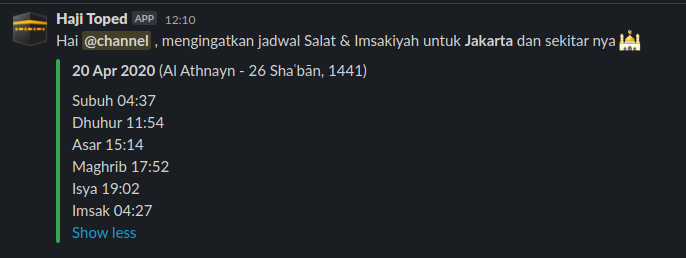

## بِسْمِ اللهِ الرَّحْمٰنِ الرَّحِيْمِ

# salat-reminder-slack

Salat Prayer Times bot for Slack integration and use API from http://api.aladhan.com

## Requirements

* Python 3
* Git
* Slack Incoming Webhook registration on your workspace at https://my.slack.com/services/new/incoming-webhook


## Setup

* Clone this repo.
* Edit the parameter, example:
```
cityname = 'Jakarta'
countryname = 'Indonesia'
color = '#36a64f'
url = f'http://api.aladhan.com/v1/timingsByAddress?address={cityname},{countryname}&method=11&tune=2,2,2,2,2,2,2,2,2'
username = 'Haji Toped'
emojicon = ':kaaba:'
webhookurl = 'https://hooks.slack.com/services/xxxx/xxxxx'
```
* Start the app with this command. NOTE that you need to have python3 installed.
```
$ python3 salat-times.py
```
- Setup a cron job to automate it

Here's how it will look like in your channel: 
